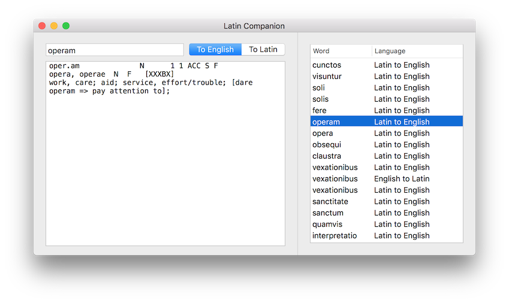

#  Latin Companion Mac

Look up Latin words using [Whitaker's Words](http://archives.nd.edu/words.html). Very useful as a translation aid for Latin scholars - and the lookup history lets you keep track of words you keep having to look up.

This is a personal project (and my first Mac app!) and it never really made it anywhere in terms of public release, although I found a lot of use in it during college.

